# LifeOS — API and mobile app

LifeOS is a productivity companion: **tasks**, **habits** (with daily logs), **journal** entries, **mood** check-ins, and an aggregated **dashboard**. This repo contains the **Laravel REST API** (Sanctum Bearer tokens) and a **Flutter** client in [`life_os_app/`](life_os_app/). Screenshots below show the mobile UI.

**Backend stack:** PHP 8.2+, Laravel 12, MySQL.

## Flutter app

- From the repo root: `cd life_os_app`
- Install dependencies: `flutter pub get`
- Run on a device or emulator: `flutter run`
- Point the app at your API base URL (includes `/api`) in [`life_os_app/lib/app/config/app_config.dart`](life_os_app/lib/app/config/app_config.dart)
- Release builds: `flutter build apk` or `flutter build appbundle`

## Screenshots

### Authentication

Sign in and create an account.

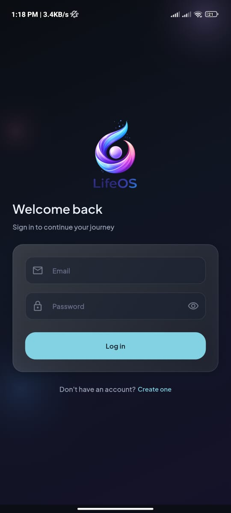

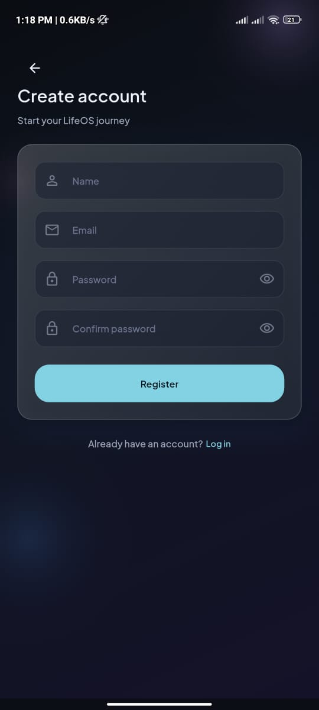

### Dashboard

Home overview and quick access to modules.

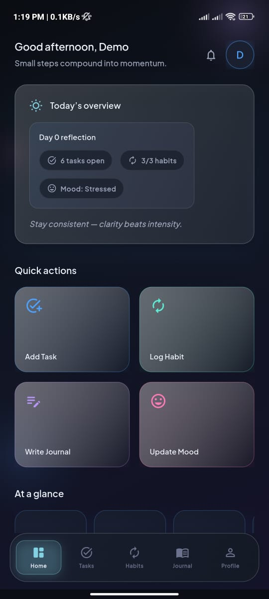

### Tasks

Task list, create flow, and task details.

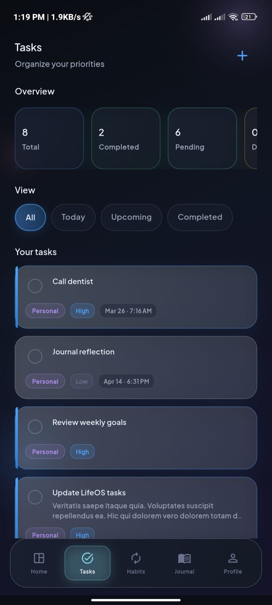

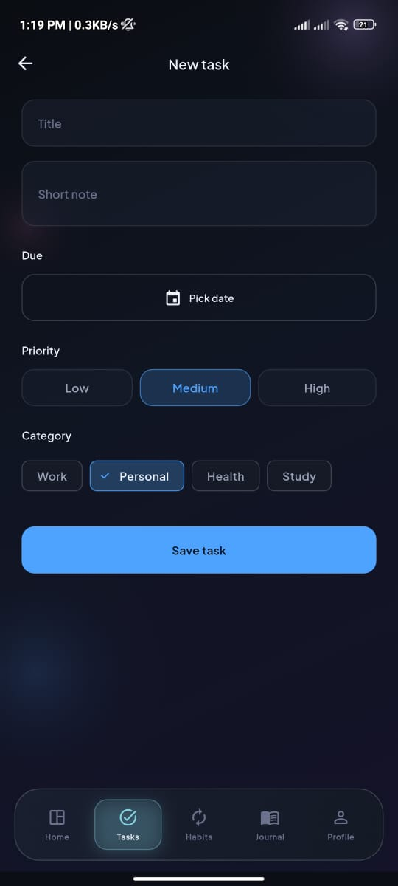

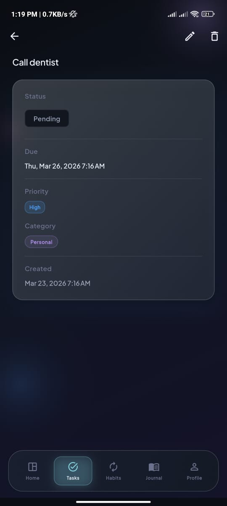

### Habits

Habit list, create flow, and habit details.

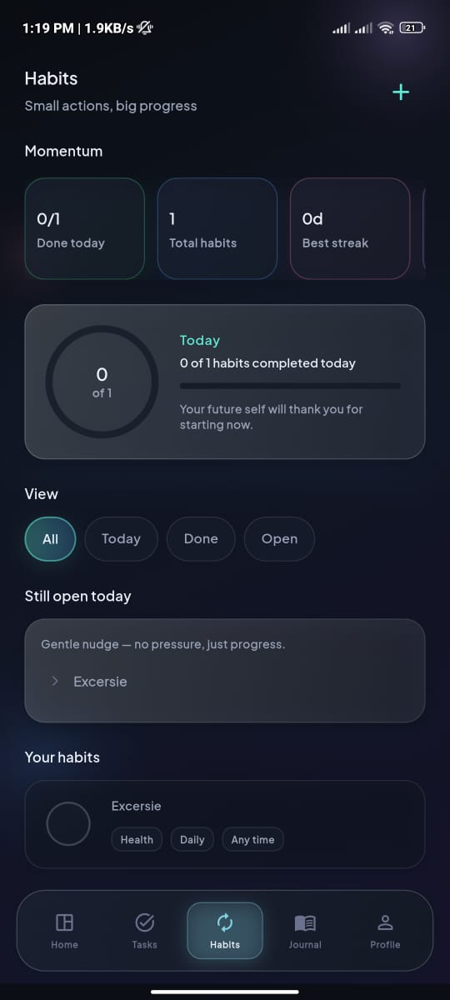

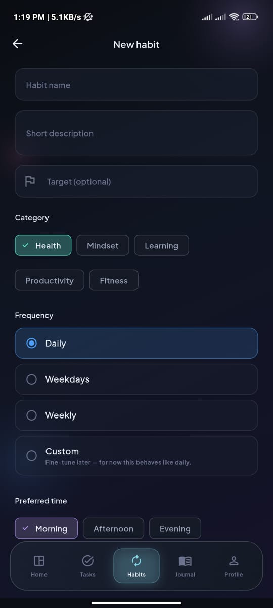

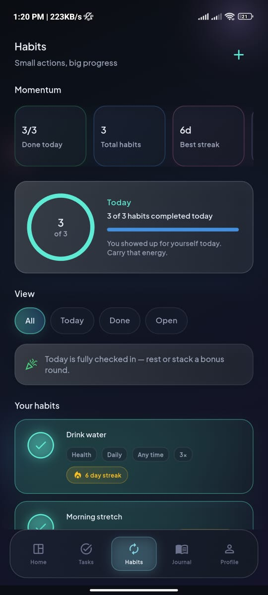

### Journal

Journal home and entries.

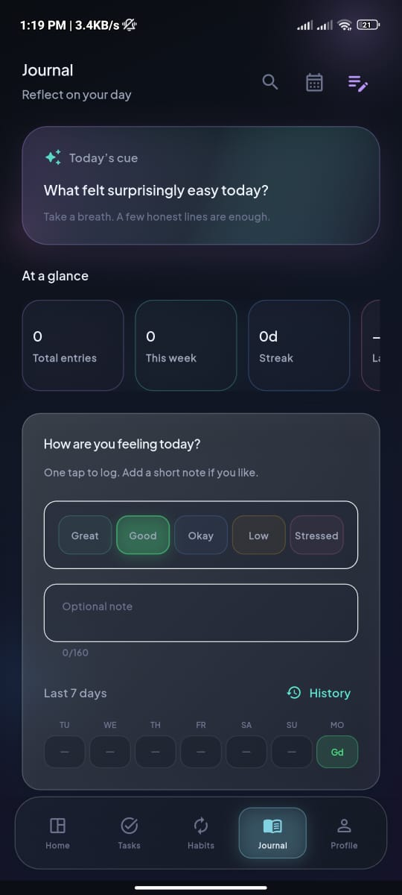

### Profile

Profile and edit profile.

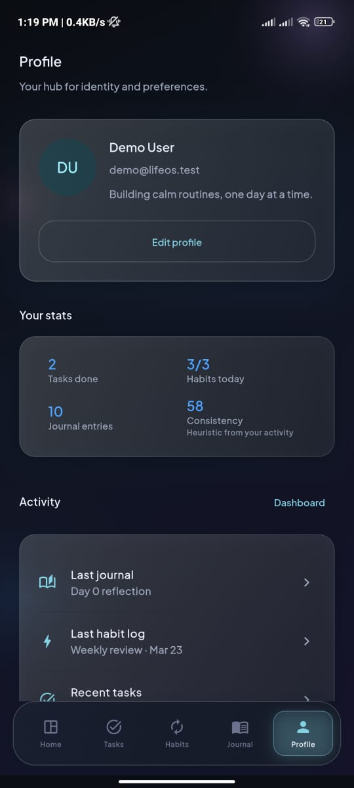

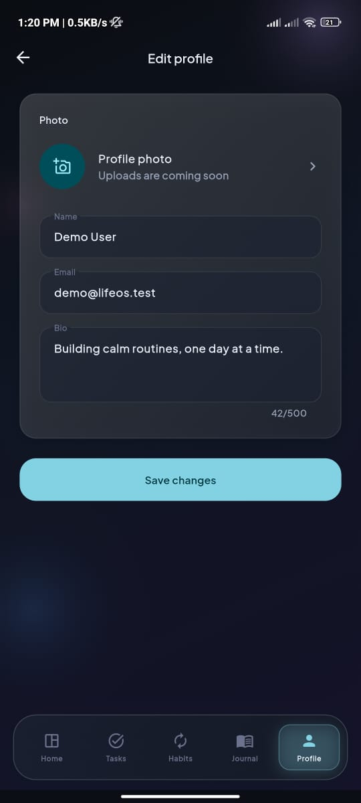

## Backend setup

1. `composer install`
2. `cp .env.example .env` and `php artisan key:generate`
3. Set MySQL in `.env` (`DB_DATABASE`, `DB_USERNAME`, etc.) and create that database
4. `php artisan migrate` (optional: `php artisan db:seed`)
5. `php artisan serve` — or serve the `public` directory via Laragon

## API

- Base path: `/api` — production: `https://life.os.thethemeai.com/api`; local: e.g. `http://127.0.0.1:8000/api`
- Register / login: `POST /api/register`, `POST /api/login` — other routes need `Authorization: Bearer {token}`
- Success body: `success`, `message`, `data` (lists may include `meta` for pagination)
- Validation errors: `success`, `message`, `errors`

Routes: [`routes/api.php`](routes/api.php)

**Postman:** [`postman/LifeOS.postman_collection.json`](postman/LifeOS.postman_collection.json) — set `baseUrl`; Register/Login store `accessToken`.

## Project docs

- [MVP database blueprint](docs/LifeOS_MVP_Database_Design_Blueprint.md)
- [Product documentation](docs/LifeOS_Product_Documentation.md)

## Tests

PHPUnit targets MySQL database **`lifeos_testing`** (see [`phpunit.xml`](phpunit.xml)). Create it: `CREATE DATABASE lifeos_testing;` — adjust credentials in `phpunit.xml` if needed. Then `php artisan test`. Optional: [`.env.testing.example`](.env.testing.example) → `.env.testing`.
